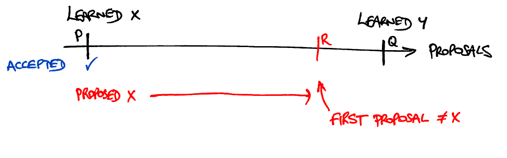
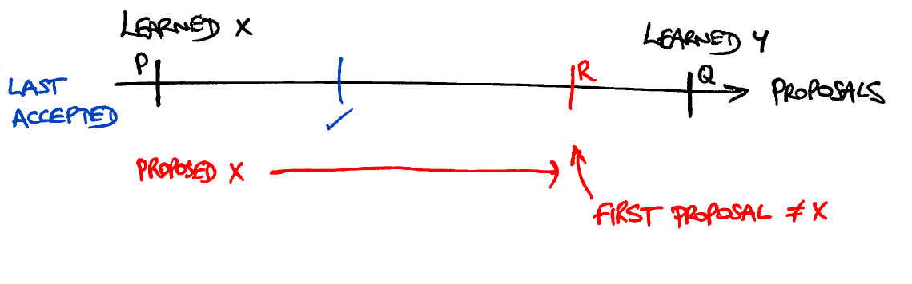
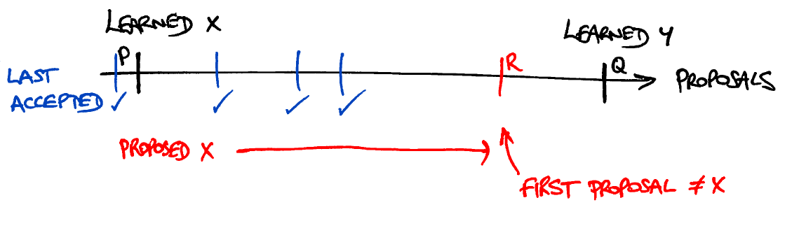

# paxos-dojo

An idea for a Leeds Code Dojo session - implement Paxos! In fact, just the
interesting core: the Synod protocol.

## Introduction

Synod is a protocol for reaching agreement on a single value in a distributed
system. Grant suggests we should use it to agree on a name for our new startup,
so get thinking of a good name to propose!

The thing about distributed systems is that you have to assume the individual
bits of the system are rather unreliable. In more detail:

- modules may fail (i.e. simply stop responding to messages) at any time
- modules may take arbitrarily long to respond
- messages may be dropped in transit (i.e. there is no guarantee that a sent
  message is ever received)
- messages may be delayed in transit and may not be received in the order in
  which they were sent

For many years it was believed that with all these things that could go wrong
it wouldn't be possible to reliably do anything at all. This protocol was
actually discovered in the process of trying to prove that no such protocol
could exist.

Of course if things go _too_ wrong then you can't really hope to achieve
anything, but this protocol guarantees that the worst thing that can happen is
that no agreement is reached, and this only happens while

- the network is dropping too many messages
- messages are being delayed too heavily in transit, or
- too many modules have failed

All of these problems tend to be transient: networks are eventually fixed and
failed modules are eventually replaced, and when the situation returns to
normal the protocol carries on and reaches agreement.

The system is unreliable but not actively malicious:

- modules all obey the protocol correctly
- messages may not be altered in transit
- message delivery is all-or-nothing

## Overview

There are four kinds of module in the protocol:

- Nag
- Proposer
- Acceptor and
- Learner

All the Nag does is periodically broadcast a message indicating the current
time, which is rather boring so has already been done. The intention is that
each team implements one of the other three modules. We need at least one
Learner, one Proposer and exactly three Acceptors:


 
When everything is working smoothly, the protocol runs as follows. First, the
Nag broadcasts the current time period to the Acceptors:


When each Acceptor receives this broadcast, it sends a message to the Proposer,
promising that in future it won't accept any proposals made before the current
time period.


When the Proposer receives these promises messages from a majority of
Acceptors (i.e. two of them), it proposes a value to agree upon in the current
time period by broadcasting a message back to all the Acceptors.


Since the Acceptors have not made any further promises, they all accept the
proposed value by sending messages to the Learner. Once the Learner receives
these messages for the same time period from a majority of Acceptors (i.e. two
of them), it has learned that this value is the one that the system has agreed
upon.


There has to be exactly three Acceptors but there can be as many Learners and
Proposers as desired. It's much more interesting if there are more than one of
each:

- With one Proposer there is only one value to be proposed (so inconsistency is
  impossible) and the system will stop working if this Proposer fails.

- With one Learner there is only one place where a value is learned (so
  inconsistency is impossible) and the system will stop working if this Learner
fails.

## Module Descriptions

For the sake of interoperability, in our implementation the modules communicate
with each other using JSON-formatted messages. This section gives the details
of the messages each module may send and receive.

### Learner

The Learner is the simplest module. Roughly speaking, it keeps track of which
values have been accepted, and when it sees that a majority of Acceptors
(i.e. two of them) are in agreement, it learns that consensus has been reached.

More precisely, it receives messages that look like this:

```javascript
{"type":"accepted","timePeriod":$TIMEPERIOD,"by":$NAME,"value":$VALUE}
```

It doesn't send any messages, but should report to the user when it has learned
a value. It learns a value by receiving two messages for the same `$TIMEPERIOD`
(a positive integer) but different `$NAME`s (which are strings). In this case,
the `$VALUE` of the two messages will always be the same, so it desn't matter
which one you choose to report.

A simple Learner implementation is to keep a list of all messages received and
check each new message against all the items that are already in the list,
looking for pairs that match on `$TIMEPERIOD` but not on `$NAME`. When such a
pair is found, simply print out the `$VALUE` from either message.

Here is an example of the expected behaviour:

```javascript
{"type":"accepted","timePeriod":1,"by":"alice","value":"value 1"}
  // no value learned - no previous messags

{"type":"accepted","timePeriod":2,"by":"brian","value":"value 2"}
  // no value learned - different $TIMEPERIOD from previous message

{"type":"accepted","timePeriod":2,"by":"brian","value":"value 2"}
  // no value learned - same $NAME as previous messages

{"type":"accepted","timePeriod":2,"by":"chris","value":"value 2"}
  -> 'value 2' // value learned - same $TIMEPERIOD but different $NAME compared with previous message
```

### Proposer

The Proposer is the next simplest module. Its job is to propose ideas for the
name of our startup. It knows your idea, which we'll call `$MYVALUE` here.
Roughly speaking, it proposes `$MYVALUE` if it hasn't receieved any other
ideas, but in the interests of harmony it prefers to agree with other
proposers' ideas when it hears about them. It also only makes a proposal when
it's received promises from a majority of Acceptors that they will accept it.
It is, in short, rather timid.

More precisely, it receives messages that look like one of these (which are
sent by Acceptors):

```javascript
{"type":"promised","timePeriod":$TIMEPERIOD,"by":$NAME,"haveAccepted":false}
{"type":"promised","timePeriod":$TIMEPERIOD,"by":$NAME,"lastAcceptedTimePeriod":$LATP,"lastAcceptedValue":$LAV}
```

When it has received two of these `promised` messages for the same
`$TIMEPERIOD` (a positive integer) with different `$NAME`s (which are strings),
it should respond with a message like this:

```javascript
{"type":"proposed","timePeriod":$TIMEPERIOD,"value":$VALUE}
```

In this situation, `$VALUE` depends on the `$LATP` and `$LAV` values in
the two `promised` messages as follows:

- If neither message includes these values then use `$MYVALUE`.

- If just one of the `promised` messages includes these values then use its
  `$LAV`.

- If both of the `promised` messages include these values then use the most
  recent `$LAV` (i.e. the one with the greater value for `$LATP`). In the case
of a tie, either will do.

It must only ever send out a single `proposed` message for each `$TIMEPERIOD`.

A simple Proposer implementation is to keep

- a list of all messages received, and
- the latest `$TIMEPERIOD` for which a `proposed` message have been sent.

When a new message is received, ignore it if its `$TIMEPERIOD` value is no
greater than the latest-proposed `$TIMEPERIOD` and otherwise check it against
all the other received messages. If any of them match on `$TIMEPERIOD` but not
on `$NAME` then take the first one and send a `proposed` message with `$VALUE`
calculated as described above.

Here is an example of the expected behaviour:

```javascript
{"type":"promised","timePeriod":1,"by":"alice","haveAccepted":false}
  // nothing proposed - no previous messages

{"type":"promised","timePeriod":2,"by":"brian","haveAccepted":false}
  // nothing proposed - different $TIMEPERIOD from previous message

{"type":"promised","timePeriod":2,"by":"brian","haveAccepted":false}
  // nothing proposed - different $TIMEPERIOD from first message and same $NAME as second message

{"type":"promised","timePeriod":2,"by":"chris","haveAccepted":false}
  -> {"type":"proposed","timePeriod":2,"value":"my awesome startup name"}
  // proposal made using $MYVALUE as no $LAV given in any promises

{"type":"promised","timePeriod":2,"by":"alice","haveAccepted":false}
  // nothing proposed - have already made a proposal for time period 2

{"type":"promised","timePeriod":3,"by":"brian","haveAccepted":false}
  // nothing proposed - different $TIMEPERIOD from all earlier messages

{"type":"promised","timePeriod":3,"by":"alice","lastAcceptedTimePeriod":1,"lastAcceptedValue":"AliceCo"}
  -> {"type":"proposed","timePeriod":3,"value":"AliceCo"}
  // proposal made using $LAV from Alice's promise as it included a lastAcceptedValue field

{"type":"promised","timePeriod":4,"by":"alice","lastAcceptedTimePeriod":1,"lastAcceptedValue":"AliceCo"}
  // nothing proposed - different $TIMEPERIOD from all earlier messages

{"type":"promised","timePeriod":4,"by":"brian","haveAccepted":false}
  -> {"type":"proposed","timePeriod":4,"value":"AliceCo"}
  // proposal made using $LAV from Alice's promise as it included a lastAcceptedValue field

{"type":"promised","timePeriod":5,"by":"alice","lastAcceptedTimePeriod":1,"lastAcceptedValue":"AliceCo"}
  // nothing proposed - different $TIMEPERIOD from all earlier messages

{"type":"promised","timePeriod":5,"by":"brian","lastAcceptedTimePeriod":2,"lastAcceptedValue":"BrianCo"}
  -> {"type":"proposed","timePeriod":5,"value":"BrianCo"}
  // proposal made using $LAV from Brian's promise as it has the greater $LATP (so is fresher than Alice's)

{"type":"promised","timePeriod":6,"by":"brian","lastAcceptedTimePeriod":2,"lastAcceptedValue":"BrianCo"}
  // nothing proposed - different $TIMEPERIOD from all earlier messages

{"type":"promised","timePeriod":6,"by":"alice","lastAcceptedTimePeriod":1,"lastAcceptedValue":"AliceCo"}
  -> {"type":"proposed","timePeriod":6,"value":"BrianCo"}
  // proposal made using $LAV from Brian's promise as it has the greater $LATP (so is fresher than Alice's)
```

### Acceptor

The Acceptor is the most complicated module. Its job is to accept proposals,
but it also makes promises about which proposals it will accept in the future
in order to persuade the somewhat timid Proposer to make the proposals in the
first place.

It has a name, `$NAME` (one of `"alice"`, `"brian"` or `"chris"`) which will be
agreed in advance as it must not clash with that of the other Acceptors. It
must include its name in the `by` field of any messages it sends.

It receives two kinds of message:

```javascript
{"type":"prepare","timePeriod":$TIMEPERIOD}
{"type":"proposed","timePeriod":$TIMEPERIOD,"value":$VALUE}
```

The `prepare` message comes from the Nag and indicates the start of a new time
period. The `proposed` message comes from a Proposer and proposes a value for
the given time period.

Under the conditions set out below it may respond to these with:

```javascript
// in response to a 'prepare':
{"type":"promised","timePeriod":$TIMEPERIOD,"by":$NAME,"haveAccepted":false}
{"type":"promised","timePeriod":$TIMEPERIOD,"by":$NAME,"lastAcceptedTimePeriod":$LATP,"lastAcceptedValue":$LAV}

// in response to a 'proposed':
{"type":"accepted","timePeriod":$TIMEPERIOD,"by":$NAME,"value":$VALUE}
```

Throughout, `$TIMEPERIOD` and `$LATP` are positive integers, and all other
values are strings.

When it receives a `prepare` message the Acceptor should compare it to the last
`accepted` message it sent:

- If it has not yet sent any `accepted` messages, it should respond with a
  `promised` message without the `lastAccepted*` fields.

- If the last `accepted` message was sent in a _strictly_ earlier time period
  than the `prepare` message's `$TIMEPERIOD` then it should respond with a
`promised` message with the `lastAccepted*` fields, where `$LAV` and `$LATP`
are respectively set to the `$VALUE` and `$TIMEPERIOD` of the last `accepted`
message.

- If the last `accepted` message was sent in an equal or later time period than
  the `prepare` message's `$TIMEPERIOD` then no `promised` message is sent.

The purpose of the `promised` message is to indicate that this Acceptor will no
longer accept any proposals from earlier time periods.

When it receives a `proposed` message, it may respond with a corresponding
`accepted` message as long as

- doing so does not break any previous promises (i.e. it has not sent a
  `promised` message for a strictly later time period)
- doing so does not clash with any previous acceptances (i.e. all `accepted`
  messages sent so far were for strictly earlier time periods)

A simple Acceptor implementation is to track the greatest `$TIMEPERIOD` for
which an `accepted` message has been sent (along with the corresponding
`$VALUE`) and also to track the greatest `$TIMEPERIOD` for which a `promised`
message has been sent. Here is an example of the expected behaviour:

```javascript
{"type":"prepare","timePeriod":2}
  -> {"type":"promised","timePeriod":2,"by":"me","haveAccepted":false}
  // NB no "lastAccepted*" as nothing accepted yet

{"type":"prepare","timePeriod":1}
  -> {"type":"promised","timePeriod":1,"by":"me","haveAccepted":false}
  // ok to send out an earlier promise too

{"type":"prepare","timePeriod":2}
  -> {"type":"promised","timePeriod":2,"by":"me","haveAccepted":false}
  // ok to send out a duplicate promise

{"type":"proposed","timePeriod":1,"value":"value 1"}
  // have promised not to accept proposals from time periods before 2 so do not respond to this

{"type":"proposed","timePeriod":2,"value":"value 2"}
  -> {"type":"accepted","timePeriod":2,"by":"me","value":"value 2"}
  // ok to accept this proposal as it is consistent with all promises: it is not in a time period before 2

{"type":"prepare","timePeriod":1}
  // last accepted message was sent in a later time period, so no response

{"type":"prepare","timePeriod":2}
  // last accepted message was sent in this time period, so no response

{"type":"prepare","timePeriod":3}
  -> {"type":"promised","timePeriod":3,"by":"me","lastAcceptedTimePeriod":2,"lastAcceptedValue":"value 2"}
  // send out a promise, but now includes "lastAccepted*" fields

{"type":"proposed","timePeriod":4,"value":"value 4"}
  -> {"type":"accepted","timePeriod":4,"by":"me","value":"value 4"}
  // ok to accept this proposal as it is from time period >= 3 so consistent with all promises

{"type":"proposed","timePeriod":4,"value":"different value 4"}
  // have already accepted proposal 4, so do not accept it again.

{"type":"proposed","timePeriod":3,"value":"value 3"}
  // have already accepted proposal 4, so do not accept earlier-numbered
  // proposals.
```

### Comms details

For the sake of simplicity, the modules will communicate with one another via a
HTTP messaging system running on the internet. Each team will get their own URL
for accessing the messaging system.

To get a pending message, perform a HTTP GET to your URL. If there is a message
waiting for you, it will immediately be returned with status `200 OK`. If there
are no messages then the GET will wait for a while to see if one turns up.
Eventually, it will return `204 No Content` if the wait was fruitless. You can
immediately retry the request at this point.

To send a message, perform a HTTP POST to your URL with `Content-type:
application/json` and the message in the body of the request. This will return
`204 No Content` if successful or `400 Bad Request` if the message was not
correctly formatted.

The Nag is built into the messaging system, and it also has the facility to
simulate network problems (message drops and delays) in order to experiment
with the protocol's reaction to failures.

### Protocol Sequence Examples

Here are some diagrams that illustrate how the modules described above all work
together to achieve consensus on a single value.

First consider the simplest situation again: one Proposer, one Learner and three
Acceptors.


The Nag sends broadcasts a `prepare` message to the Acceptors for the first time
period.


In turn, the Acceptors send `promised` messages to the Proposer. Note that none
of these have `lastAccepted*` fields since no acceptor has accepted a value
yet.


When the Proposer receives two of these `promised` messages, it broadcasts a
`proposed` message back to all the Acceptors. Since none of the `promised`
messages have `lastAccepted*` fields, the value proposed is `$MYVALUE`.


The Acceptors may all accept this proposal as it's compatible with the promises
they made previously. They send `accepted` messages to the Learner, and once
the Learner receives two of these messages it learns that consensus has been
achieved.


This demonstrates the basic message flow, but since there's only one Proposer
and one the Learner the system cannot end up disagreeing on the value chosen.
Consider a more complicated situation with two Proposers and two Learners as
follows.


The Nag sends broadcasts a `prepare` message to the Acceptors for the first time
period.


Again, the Acceptors all send out `promised` messages, and again these do not
have `lastAccepted*` fields since no value has been accepted.

Note also that this is not a broadcast: these messages are routed to a single
Proposer. In a real implementation, the choice of Proposer for this time period
would be made by the Nag in the very first step, and this choice would have to
be passed around in every message. This only serves to make it harder to
understand what is going on, so it has been omitted. Instead, since the Nag is
built into the messaging system it can route `promised` messages to the right
proposer without bothering the individual modules with this detail.


If things carried on without a hitch then the second Proposer wouldn't get to
do anything, so let's consider the case where two of the `promised` messages
are not delivered.


Since the Proposer has only received a single `promised` message, it does
nothing. Eventually the Nag broadcasts another `prepare` message for the second
time period.


The Acceptors all send out further `promised` messages which are routed to the
second Proposer.  Note that still no Acceptor has accepted a value yet, so
these `promised` messages still do not have `lastAccepted*` fields.


They arrive successfully, so the Proposer broadcasts a `proposal` with its own
value.


The Acceptors may all accept this proposal as it's compatible with the promises
they made previously. They broadcast `accepted` messages to the Learners, which
are all delivered successfully so both Learners learn the value chosen.


But there's more! Imagine that the undelivered `promised` messages were merely
delayed and not dropped, and that one more of them is now delivered.


At this point the first Proposer broadcasts a `proposed` message with its own
value, which is different from the other Proposer's value.


But this `proposed` message is not compatible with the Acceptors' promises any
more: they promised to accept no propositions in time periods before the
second, but this proposal was for the first time period. The message is dropped
by all Acceptors, and there is no inconsistency in the values accepted.

Here is an illustration of another kind of network glitch, showing why
the Acceptors include the details of what they have previously accepted. Again,
it starts with the Nag broadcasting a `prepare` message for the first time period.


The Acceptors send out `promised` messages which are routed to the first
Proposer.


When the Proposer receives two, it proposes its value.


This proposal is compatible with earlier promises, so it is accepted by all the
Acceptors. But this time the network glitch drops all the messages to the
second learner. The first learner learns the proposed value, but the second is
none the wiser.


Eventually, the Nag sends out another `prepare` message for the second time
period.


The Acceptors send out `promised` messages in reaction. However, since they
have all previously accepted a value, these messages include `lastAccepted*`
fields.


When the Proposer receives two of these `promised` messages, it sends out a
proposal. Crucially, it may not propose its own value as it received
`lastAccepted*` fields, which by the rules above it must propose instead. Thus
it proposes the same value as the one the other Proposer previously proposed.


The proposal is compatible with the promises, so it is accepted. This time, the
`accepted` messages make it through to the other Learner so it now learns the
same value that the first Learner learned in the previous time period.


### Correctness Proof

There are obviously many more ways that things can go wrong, but it is possible
to prove that no matter how badly the network is performing everything still
remains consistent. In more detail, all values learned by all learners must be
equal. To see this, consider two proposals _P_ and _Q_ whose values have been
learned by any of the learners (not necessarily the same one):


This is a <a href='https://en.wikipedia.org/wiki/Proof_by_contradiction'>proof
by contradiction</a>, so suppose that the protocol was incorrect and that the
values learned were different:


Then the values proposed were also different:


Now consider also the proposals that have been made (or will ever be made)
between _P_ and _Q_:


Find the earliest proposal _R_ later than _P_ but no later than _Q_ whose value
is not **X**:


Put differently, all the ones earlier than _R_ but no earlier than _P_ have
value **X**:


The value of _P_ must have been learned because it was accepted by a majority
_S_ of acceptors, and the value for _R_ was proposed because of promises from
another majority of acceptors which therefore overlaps _S_.


Because the two majorities must overlap there must be an acceptor, say `alice`,
who accepted _P_ and then promised to accept _R_. It must have happened in that
order as, having promised to accept _R_, `alice` would then not have been able
to accept _P_. So the promise `alice` made would have included a
`lastAcceptedValue` of **X**.



This is true even if `alice` accepted a later proposal than _P_ before
promising to accept _R_: all such proposals have value **X**.



Therefore the promise made by `alice` must have included a
`lastAcceptedTimePeriod` that is no earlier than _P_ and is strictly earlier
than _R_, and the `lastAcceptedValue` is **X**. The other promises may also
have included a `lastAcceptedTimePeriod`, all of which are strictly less than
_R_:



In any case, the value proposed for _R_ must be the `lastAcceptedValue` of the
promise with greatest `lastAcceptedTimePeriod`, which must be **X** as it is no
earlier than _P_ and strictly earlier than _R_. This means that _R_ didn't have
a different value from _P_, which is a contradiction. Therefore the original
assumption that _P_ and _Q_ had different values was wrong, and hence any two
learned values must be equal.
