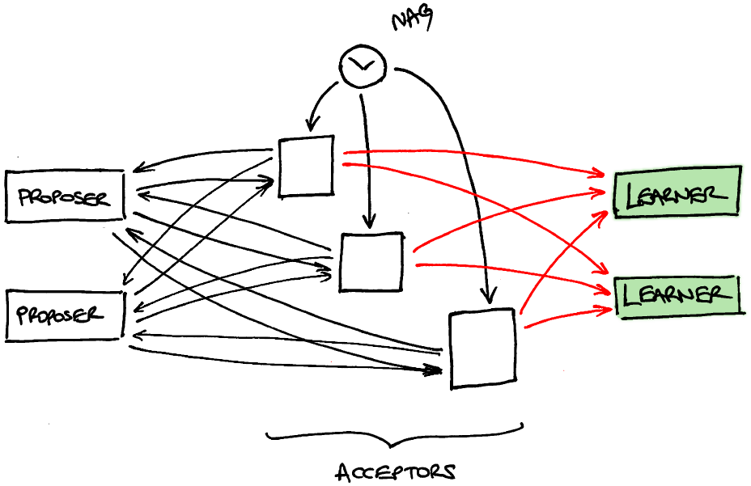

# paxos-dojo

An idea for a Leeds Code Dojo session - implement Paxos! In fact, just the
interesting core: the Synod protocol.

## Overview

The objective of the protocol is for a distributed system to reach agreement on
a single value (a string) by communicating over the network. The clever bit is
that the protocol still works even if the network is unreliable: messages may
be delayed, reordered or even dropped and the protocol still works. The worst
thing that can happen is that no agreement is reached, and this only happens
while the network is dropping messages: as soon as enough messages start to get
through again, agreement will be reached.

There are three kinds of module in the protocol, known as Learner, Proposer and
Acceptor. The intention is that each team implements one of these, although
faster teams may be able to do more than one.

We need at least one Learner, one Proposer and exactly three Acceptors, however
things get more interesting if there is more than one Learner and Proposer -
it's kind of trivial if there's only one of each.

The modules will communicate via a central bus running in the cloud. Performing
a HTTP GET will return a JSON-formatted message, if one is available. If not,
the bus will wait for a while to see if one becomes available, and eventually
return `204 No Content` if the wait is fruitless. The module should then retry
its GET.

Messages can be sent with a separate HTTP POST to the bus.

## Module Descriptions

This section describes what messages each module may send and receive.  Since
the protocol continues to work even if some messages are lost, it is ok for
modules to choose to ignore a received message, and not to send a message even
if this section permits it. On the other hand, everything goes wrong if you
send a message that isn't permitted, so it is important to err on the side of
caution. That said, if too many messages are ignored then agreement will never
be reached, so don't be too cautious!

### Learner

The Learner is the simplest module. It receives messages that look like this:

```javascript
{"type":"accepted","proposal":$PROP,"by":$NAME,"value":$VALUE}
```

It doesn't send any messages, but should report to the user when it has learned
a value. It learns a value by receiving two messages for the same `$PROP` (an
integer) but different `$NAME`s. In this case, the `$VALUE` of the two messages
will always be the same, so it desn't matter which one you choose to report.

A simple Learner implementation is to keep a list of all messages received and
check each new message against all the items that are already in the list,
looking for pairs that match on `$PROP` but not on `$NAME`. When such a pair is
found, simply print out the `$VALUE` from either message.

Here is an example of the expected behaviour:

```javascript
{"type":"accepted","proposal":1,"by":"alice","value":"value 1"}
  // no value learned - no previous messags

{"type":"accepted","proposal":2,"by":"brian","value":"value 2"}
  // no value learned - different $PROP from previous message

{"type":"accepted","proposal":2,"by":"brian","value":"value 2"}
  // no value learned - different $PROP from or same $NAME as previous messages

{"type":"accepted","proposal":2,"by":"chris","value":"value 2"}
  -> 'value 2' // value learned - same $PROP but different $NAME compared with previous message
```

There can be as many Learners running as desired. The fundamental point of
Paxos is that all values learned by all Learners are equal.

### Proposer

The Proposer is the next simplest module. It has a constant string, `$MYVALUE`,
which it would like all the Learners to learn. This string can be whatever you
want as long as it does not change once the protocol has started. It is a good
idea to include your names or a team identifier so you can track it.

It receives messages that look like one of these (which are sent by Acceptors):

```javascript
{"type":"promised","proposal":$PROP,"by":$NAME}
{"type":"promised","proposal":$PROP,"by":$NAME,"max-accepted-proposal":$MAXPROP,"max-accepted-value":$MAXVALUE}
```

In other words, the `max-accepted-proposal` and `max-accepted-value` fields are
optional, but not independently: either both are present or both are absent.

When it has received two of these `promised` messages for the same `$PROP` (an
integer) with different `$NAME`s, it should respond with a message like this:

```javascript
{"type":"proposed","proposal":$PROP,"value":$VALUE}
```

In this situation, `$VALUE` depends on the `$MAXVALUE` and `$MAXPROP` values in
the two `promised` messages as follows:

- If neither message includes the `max-accepted-value` field then use
  `$MYVALUE`, the constant string that you want everyone to learn.

- If just one of the `promised` messages includes the
  `max-accepted-value:$MAXVALUE` field then use `$MAXVALUE`.

- If both of the `promised` messages include the `max-accepted-value:$MAXVALUE`
  field then it is the `$MAXVALUE` of the message with the greater value of
`$MAXPROP`. In the case of a tie, either will do.

It must only ever send out a single `proposed` message for each `$PROP`.

A simple Proposer implementation is to keep

- a list of all messages received, and
- a list of all `$PROP` values for which `proposed` messages have been sent.

When a new message is received, ignore it if its `$PROP` value appears in the
already-sent list and otherwise check it against all the other received
messages.  If any of them match on `$PROP` but not on `$NAME` then send a
`proposed` message with `$VALUE` calculated as described above.

Here is an example of the expected behaviour:

```javascript
{"type":"promised","proposal":1,"by":"alice"}
  // nothing proposed - no previous messages

{"type":"promised","proposal":2,"by":"brian"}
  // nothing proposed - different $PROP from previous message

{"type":"promised","proposal":2,"by":"brian"}
  // nothing proposed - different $PROP from or same $NAME as previos messages

{"type":"promised","proposal":2,"by":"chris"}
  -> {"type":"proposed","proposal":2,"value":"my value"}
  // proposal made using $MYVALUE as no max-accepted-value field in any promises

{"type":"promised","proposal":2,"by":"alice"}
  // nothing proposed - proposal 2 has already been made

{"type":"promised","proposal":3,"by":"brian"}
  // nothing proposed - new promise for proposal 3

{"type":"promised","proposal":3,"by":"alice","max-accepted-proposal":1,"max-accepted-value":"alice's value"}
  -> {"type":"proposed","proposal":3,"value":"alice's value"}
  // proposal made using value from Alice's promise as it included a max-accepted-value field

{"type":"promised","proposal":4,"by":"alice","max-accepted-proposal":1,"max-accepted-value":"alice's value"}
  // nothing proposed - new promise for proposal 4

{"type":"promised","proposal":4,"by":"brian"}
  -> {"type":"proposed","proposal":4,"value":"alice's value"}
  // proposal made using value from Alice's promise as it included a max-accepted-value field

{"type":"promised","proposal":5,"by":"alice","max-accepted-proposal":1,"max-accepted-value":"alice's value"}
  // nothing proposed - new promise for proposal 5

{"type":"promised","proposal":5,"by":"brian","max-accepted-proposal":2,"max-accepted-value":"brian's value"}
  -> {"type":"proposed","proposal":5,"value":"brian's value"}
  // proposal made using value from Brian's promise as it had the greater value for max-accepted-proposal

{"type":"promised","proposal":6,"by":"brian","max-accepted-proposal":2,"max-accepted-value":"brian's value"}
  // nothing proposed - new promise for proposal 6

{"type":"promised","proposal":6,"by":"alice","max-accepted-proposal":1,"max-accepted-value":"alice's value"}
  -> {"type":"proposed","proposal":6,"value":"brian's value"}
  // proposal made using value from Brian's promise as it had the greater value for max-accepted-proposal
```

### Acceptor

The Acceptor is the most complicated module. It has a name, `$NAME` (one of
`"alice"`, `"brian"` or `"chris"`) which will be agreed in advance as it must
not clash with that of the other Acceptors. It should include this name in the
`by` field of any messages it sends.

It receives two kinds of message:

```javascript
{"type":"prepare","proposal":$PROP}
{"type":"proposed","proposal":$PROP,"value":$VALUE}
```

Under the conditions set out below it may respond to these with:

```javascript
// in response to a 'prepare':
{"type":"promised","proposal":$PROP,"by":$NAME}
{"type":"promised","proposal":$PROP,"by":$NAME,"max-accepted-proposal":$MAXPROP,"max-accepted-value":$MAXVALUE}

// in response to a 'proposed':
{"type":"accepted","proposal":$PROP,"by":$NAME,"value":$VALUE}
```

A `promised` message is sent in response to the receipt of a `prepare` message.
The values of `$MAXPROP` and `$MAXVALUE` are calculated by considering the
`accepted` messages that have already been sent with a (strictly) smaller
`$PROP` value:

- If no such `accepted` message has been sent, the `max-accepted-proposal` and
  `max-accepted-value` fields must be omitted.

- If at least one `accepted` message has been sent, then `$MAXPROP` must be the
  greatest `$PROP` from such a message, and `$MAXVALUE` must be the
corresponding `$VALUE`.

An `accepted` message is sent in response to the receipt of a `proposed`
message as long as no `promised` message has already been sent with a
(strictly) greater `$PROP` value.

The `proposed` message comes from one of the Proposers, and the `prepare`
message comes from a separate module, called the Nag, which simply sends out
`prepare` messages periodically, with increasing `$PROP` values. The Nag
ensures that consensus is reached as long as the network is eventually
reliable.

The obvious Acceptor implementation is to track all sent messages and apply the
logic described above when handling a newly-received message.

It is actually enough just to track the greatest `$PROP` for which an
`accepted` message has been sent (along with the corresponding `$VALUE`) and
also to track the greatest `$PROP` for which a `promised` message has been
sent. This isn't enough information to handle all possible future messages, but
in practice it works just fine. This is the recommended implementation.

Here is an example of the expected behaviour, tracking just the greatest
`$PROP` values:

```javascript
{"type":"prepare","proposal":2}
  -> {"type":"promised","proposal":2,"by":"me"}
  // NB no "max-accepted-proposal" or "max-accepted-value" as nothing accepted yet

{"type":"prepare","proposal":1}
  -> {"type":"promised","proposal":1,"by":"me"}
  // ok to send out an earlier promise too

{"type":"prepare","proposal":2}
  -> {"type":"promised","proposal":2,"by":"me"}
  // ok to send out a duplicate promise

{"type":"proposed","proposal":1,"value":"value 1"}
  // have promised not to accept proposals < 2 so do not respond to this

{"type":"proposed","proposal":2,"value":"value 2"}
  -> {"type":"accepted","proposal":2,"by":"me","value":"value 2"}
  // ok to accept this proposal as it is >= 2 so consistent with all promises

{"type":"prepare","proposal":1}
  // no response as have accepted a >= proposal

{"type":"prepare","proposal":2}
  // no response as have accepted a >= proposal

{"type":"prepare","proposal":3}
  -> {"type":"promised","proposal":3,"by":"me","max-accepted-proposal":2,"max-accepted-value":"value 2"}
  // send out a promise, but now includes "max-accepted-proposal" and "max-accepted-value"

{"type":"proposed","proposal":4,"value":"value 4"}
  -> {"type":"accepted","proposal":4,"by":"me","value":"value 4"}
  // ok to accept this proposal as it is >= 3 so consistent with all promises

{"type":"proposed","proposal":4,"value":"different value 4"}
  // have already accepted proposal 4, so do not accept it again. Technically,
  // could re-send:
  //     {"type":"accepted","proposal":4,"by":"me","value":"value 4"}
  // (NB the value must be what was originally accepted) but this is
  // unnecessary and makes the implementation more complicated.

{"type":"proposed","proposal":3,"value":"value 3"}
  // have already accepted proposal 4, so do not accept earlier-numbered
  // proposals. Technically, could send:
  //     {"type":"accepted","proposal":3,"by":"me","value":"value 3"}
  // as proposal 3 has not been accepted, but this is unnecessary and makes the
  // implementation more complicated.
```

### Protocol Flows

Here are some diagrams that illustrate how the modules described above all work
together to achieve consensus on a single value.

First consider the simplest situation: one proposer, one learner and three
acceptors (and a nag).


When the nag's timeout expires, it broadcasts a `prepare` message to the
acceptors with `$PROP=1`.


In turn, the acceptors send `promised` messages to the proposer. Note that
since no acceptor has accepted a value yet, these `promised` messages do not
have a `max-accepted-value` field.


When the proposer receives two of these `promised` messages, it broadcasts a
`proposed` message back to all the acceptors. Since none of the `promised`
messages have a `max-accepted-value` field, the value proposed is `$MYVALUE`.


The acceptors may all accept this proposal as it's compatible with the promises
they made previously. They send `accepted` messages to the learner, and once
the learner receives two of these messages it learns the value and goes green.


This demonstrates the basic message flow, but since there's only one proposer
there's only one value that could be proposed, and since there's only one
learner there is no risk of disagreeing on the value learned. Consider a more
complicated situation with two proposers and two learners as follows.


Again, the nag broadcasts a `prepare` message with `$PROP=1`.


Again, the acceptors all send out `promised` messages. Note that this is not a
broadcast: these messages are routed to a single proposer. Here, since there
are two proposers this can be done by looking at whether `$PROP` is odd or
even: since it is odd, the promises are sent to the first proposer. Note also
that since no acceptor has accepted a value yet, these `promised` messages do
not have a `max-accepted-value` field.


However, at this point a network glitch causes two of the `promised` messages
to be lost.


Since the proposer has only received a single `promised` message, it does
nothing. Eventually the nag broadcasts another `prepare` message, this time
with `$PROP=2`.


The acceptors all send out further `promised` messages. Since `$PROP` is even,
they go to the second proposer.  Note that still no acceptor has accepted a
value yet, so these `promised` messages do not have a `max-accepted-value`
field.


They arrive successfully, so the proposer broadcasts a `proposal` with its own
value.


The acceptors may all accept this proposal as it's compatible with the promises
they made previously. They broadcast `accepted` messages to the learners, and
once each learner receives two of these messages it learns the value and goes
green.


However, imagine that the network glitch earlier was only temporary and one
more `promised` messages is now delivered.


At this point the first proposer broadcasts a `proposed` message with its own
value, which is different from the other proposer's value.


But this `proposed` message is not compatible with the acceptors' promises any
more: they promised to accept no earlier proposition that `$PROP=2` but this
message has `$PROP=1`. The message is dropped, and there is no inconsistency in
the values accepted.

Here is an illustration of another kind of network glitch, showing the purpose
of the slightly mysterious `max-accepted-value` field. Again, it starts with
the nag broadcasting a `prepare` message with `$PROP=1`.


The accetors send out `promised` messages to the first proposer.


When the proposer receives two, it proposes its value.


This proposal is compatible with earlier promises, so it is accepted by all the
acceptors. But this time the network glitch drops all the messages to the
second learner. The first learner learns the proposed value and goes green but
the second is none the wiser.


Eventually, the nag sends out another `prepare` message with `$PROP=2`.


The acceptors send out `promised` messages in reaction. However, since they
have all previously accepted a value, these messages include the
`max-accepted-value` field containing the value they previously accepted.


When the proposer receives two of these `promised` messages, it sends out a
proposal. Crucially, it may not propose its own value as it received a
`max-accepted-value`, which by the rules above it must propose instead. Thus it
proposes the same value as the other proposer previosuly proposed.


The proposal is compatible with the promises, so it is accepted. This time, the
`accepted` messages make it through to the other learner so it now learns the
value.



Thus the `max-accepted-value` field ensures that proposers cannot propose their
own values once a different value has been learned.

## Full Paxos

An extension, probably not possible in a single dojo. Note that deciding one
value is useful but really need to decide a _sequence_ of values.

Do this by running a sequence of Synod protocols as described above, called
_instances_ and numbered from 0. The instances are effectively independent
copies of the protocol running above, and messages are now decorated with an
`instance` field indicating the instance that they apply to.

### Learner

Again, the learner is the simplest module. The messages it now receives are the
same as before except for an extra `instance` field containing a number:

```javascript
{"instance":$INSTANCE,"type":"accepted","proposal":$PROP,"by":$NAME,"value":$VALUE}
```

It doesn't send any messages, but should report to the user when it has learned
a value. It learns a value by receiving two messages for the same `$PROP` (an
integer) and `$INSTANCE` but different `$NAME`s. In this case, the `$VALUE` of
the two messages will always be the same, so it desn't matter which one you
choose to report.

The previous implementation, keeping all received messages in a list, is still
a fine approach.


### Proposer

Again, the Proposer is the next simplest module. It now has a sequence of
constant strings, `$MYVALUE(0)`, `$MYVALUE(1)`,... where it would like all the
Learners to learn the string `$MYVALUE($INSTANCE)` for each instance. These
strings can be whatever you want as long as they do not change once the
protocol has started. It is a good idea to include your names or a team
identifier so you can track them. You can either define your sequence
statically or else allow the user to add to the sequence as the proposer runs.

As before, it receives messages that look like one of these (which are sent by
Acceptors):

```javascript
{"instance":$INSTANCE,"type":"promised","proposal":$PROP,"by":$NAME}
{"instance":$INSTANCE,"type":"promised","proposal":$PROP,"by":$NAME,"max-accepted-proposal":$MAXPROP,"max-accepted-value":$MAXVALUE}
```

In other words, the `max-accepted-proposal` and `max-accepted-value` fields are
optional, but not independently: either both are present or both are absent.

When it has received two of these `promised` messages for the same `$PROP` (an
integer) and `$INSTANCE` with different `$NAME`s, it should respond with a
message like this:

```javascript
{"instance":$INSTANCE,"type":"proposed","proposal":$PROP,"value":$VALUE}
```

The `$VALUE` should be calculated as described above.

There is now a third kind of message it might receive from an Acceptor:

```javascript
{"instance":$INSTANCE,"type":"promised","proposal":$PROP,"by":$NAME,"includes-greater-instances":true}
```

This should be handled as if it were a collection of messages like this, for
_every_ `$INSTANCE2 >= $INSTANCE`:

```javascript
{"instance":$INSTANCE2,"type":"promised","proposal":$PROP,"by":$NAME}
```

This means that, if you receive two of these `includes-greater-instances`
messages, you may respond with a whole collection of `proposed` messages: one
for each matching entry in your `$MYVALUE()` list.

The previous implementation, keeping all received messages in a list, is still
a fine approach.

### Acceptor

The Acceptor is again the most complicated module. It has a name, `$NAME` (one
of `"alice"`, `"brian"` or `"chris"`) which will be agreed in advance as it
must not clash with that of the other Acceptors. It should include this name in
the `by` field of any messages it sends.

It receives two kinds of message:

```javascript
{"instance":$INSTANCE,"type":"prepare","proposal":$PROP,"includes-greater-instance":true}
{"instance":$INSTANCE,"type":"proposed","proposal":$PROP,"value":$VALUE}
```

Similarly to before, it may respond to these with:

```javascript
// in response to a 'prepare':
{"instance":$INSTANCE,"type":"promised","proposal":$PROP,"by":$NAME}
{"instance":$INSTANCE,"type":"promised","proposal":$PROP,"by":$NAME,"max-accepted-proposal":$MAXPROP,"max-accepted-value":$MAXVALUE}
{"instance":$INSTANCE,"type":"promised","proposal":$PROP,"by":$NAME,"includes-greater-instances":true}

// in response to a 'proposed':
{"instance":$INSTANCE,"type":"accepted","proposal":$PROP,"by":$NAME,"value":$VALUE}
```

Note that the `prepare` message always includes greater instances, which
complicates the calculation of which `promised` messages (plural) to send.
It's always possible to send a promised message which includes greater
instances too, for a sufficiently large instance that no `accepted` message has
yet been sent. The remaining instances should be calculated separately as
before.

For an implementation, it remains viable to track all sent messages, or else
just the maximum accepted and promised values on an instance-by-instance basis.

## Further Enhancements

TODO more flexible majorities rather than just 2-of-3. Weight functions.

TODO only choose an instance when previous instance's value has been learned

TODO break down proposal ids - last digit is proposer id

TODO altering the topology. topology version in proposal id.

TODO stop working on an instance once value has been learned - discard associated data and ignore future messages. broadcast this. catch up.

TODO combine modules into a single thing
