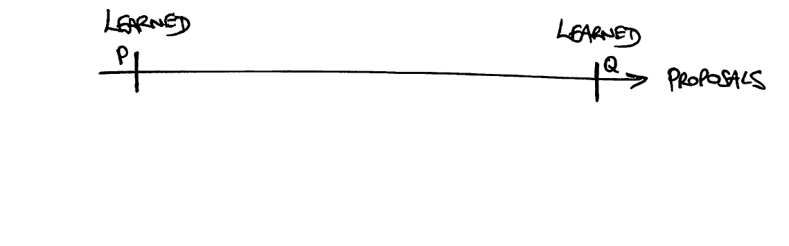
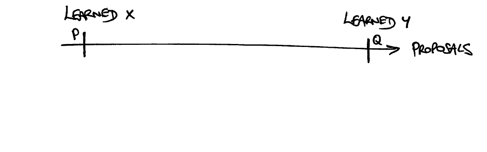
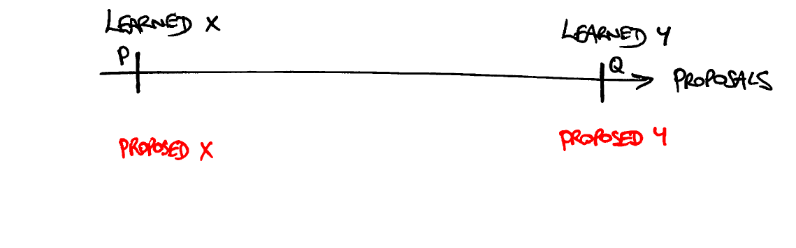
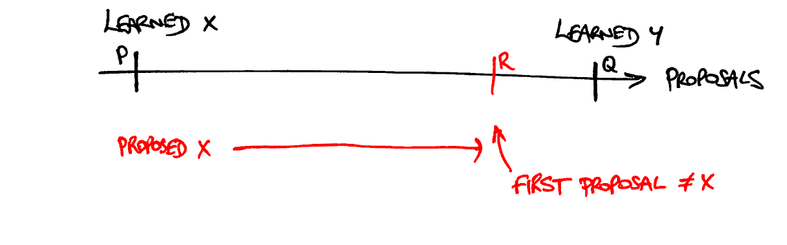

### Correctness Proof

The protocol guarantees that all values learned by all learners must be equal.
To see this, consider two proposals _P_ and _Q_ whose values have been learned
by any of the learners (not necessarily the same one):

This is a <a href='https://en.wikipedia.org/wiki/Proof_by_contradiction'>proof
by contradiction</a>, so suppose that the protocol was incorrect and that the
values learned were different:

Then the values proposed were also different:

Now consider also the proposals that have been made (or will ever be made)
between _P_ and _Q_:

Find the earliest proposal _R_ later than _P_ but no later than _Q_ whose value
is not **X**:

Put differently, all the ones earlier than _R_ but no earlier than _P_ have
value **X**:

The value of _P_ must have been learned because it was accepted by a majority
_S_ of acceptors, and the value for _R_ was proposed because of promises from
another majority of acceptors which therefore overlaps _S_. Pick one of the
acceptors in the overlap, say `alice`, who accepted _P_ and then promised to
accept _R_. It must have happened in that order as, having promised to accept
_R_, `alice` would then not have been able to accept _P_.

Of course `alice` may also have accepted some proposals later than _P_ before
promising to accept _R_. In any case, the highest-numbered one accepted by
`alice` has value **X** as it is no earlier than _P_ and is strictly earlier
than _R_.

Therefore when `alice` promised to accept _R_, the promise must have included a
`lastAcceptedTimePeriod` that is no earlier than _P_ and is strictly earlier
than _R_, and the `lastAcceptedValue` is **X**. The other promises may also
have included a `lastAcceptedTimePeriod`, all of which are strictly less than
_R_:

In any case, the value proposed for _R_ must be the `lastAcceptedValue` of the
promise with greatest `lastAcceptedTimePeriod`, which must be **X** as it is no
earlier than _P_ and strictly earlier than _R_. This means that _R_ didn't have
a different value from _P_, which is a contradiction. Therefore the original
assumption that _P_ and _Q_ had different values was wrong, and hence any two
learned values must be equal.
